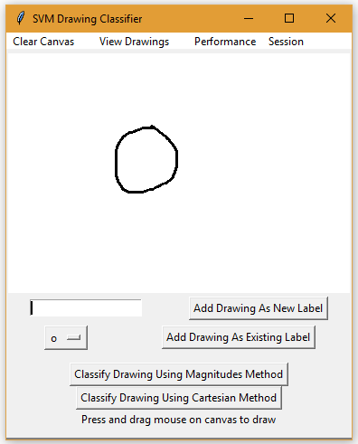
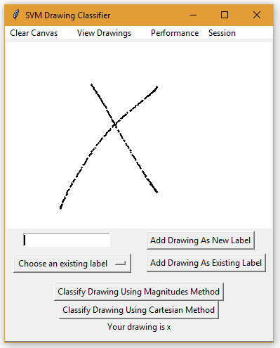
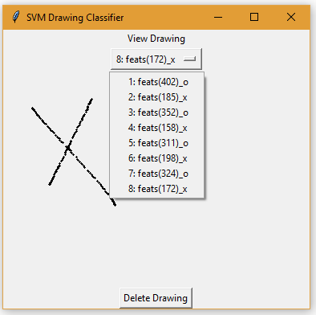
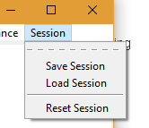
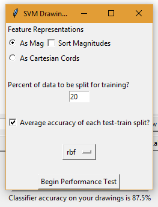
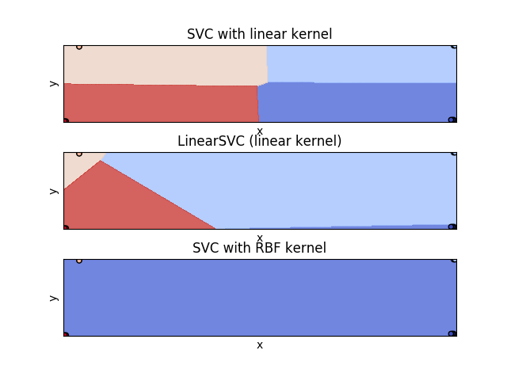

# SVM Drawing Classifier

This application demonstrates two different approaches for classifying drawings using a scikit-learn SVM classifier.

Users create drawings by clicking and dragging on a blank canvas. After a user completes their masterpiece (in our demonstration 
we will stick to "X" and "O" drawings), they give it a title, or label. To increase the accuracy of the classifier, it is
recommended that multiple drawings of the same label are created and entered into the collection using the "Add Drawing As Existing Label"
button.

Each drawing is represented as a collection of tiny ovals that are painted onto the GUI canvas when the user clicks and drags 
their mouse. Each point (oval) can be represented by its x, y Cartesian coordinate pair or its magnitude and direction.

## Application Features

- Create drawings
- Label drawings
- Get label of unlabeled drawing (Hopefully) 

- View drawings and the number of points (features) used to make them

- Save or load sessions of drawings and their corresponding labels

- Test performance of SVM classifier using different kernels and feature representations

- View graph of classifier separations in 2D space of rbf and linear kernels

## Classification

Features are represented in one of two ways:

- Cartesian Coordinates (2 total, thus two dimensional) 
- Magnitudes (X total where X is the number of ovals used to create any drawing)

The classifier is trained using a polynomial kernel when given examples with magnitudes as features 
and a linear kernel when given examples with Cartesian coordinates as features. The trade off in performance is the dimensionality of 
each representation. The Cartesian coordinate representation separates each coordinate pair as a distinct example with corresponding label.
The magnitude method representation allows for each drawing to be trained as a single example, but with a large number of features, and thus
the transformations done in training to find the optimal hyperplane are more intensive per example. 

It turns out that training using the magnitude representation is faster, but requires additional preprocessing. Due to the
nature of the SVM classifier, each example must have the same number of features. Since the drawings provided by users are free-form 
in the sense that they are unbounded in the number of ovals that can be drawn, each drawing will have a different number of features. 

To solve this problem each feature set's lengths are adjusted to the length of the smallest feature set across all examples. In order
to preserve data, this adjustment maintains the "shape" of the drawing by removing points between each point to lessen the density of the 
drawing.

## Performance Testing

The magnitude method has proven to be the winner of the representations in both both performance time and accuracy. 

You can sort the magnitudes by size before they are passed as features, however this tends to lessen the accuracy. This is due
to the sequence used to create each drawing. For instance if an X is drawn from bottom to top for each training example, and 
then drawn top to bottom, the classifier is less likely to correctly classify it because the order of the features are reversed.
However, since people tend to draw simple shapes using the same patterns, this isn't too much of a concern. The scope of this 
project does not encompass multiple artists, but one drawing simple shapes such as X and O's. 